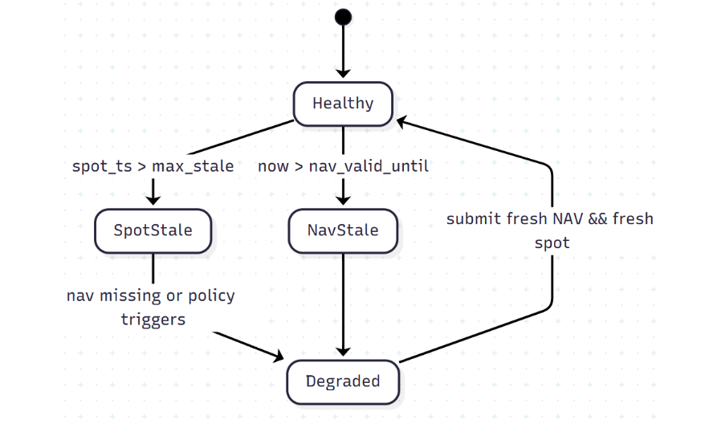

# PanoramaBlock - SRWA Standard Documentation

Welcome to the PanoramaBlock technical documentation. This repository contains comprehensive documentation for the SRWA (Stellar Real-World Asset) standard and the PanoramaBlock ecosystem for institutional RWA lending on Stellar.

## 📚 Table of Contents

- [Overview](#overview)
- [Part I: Technical Vision & Strategy](#part-i-technical-vision--strategy)
- [Part II: SRWA Token & Compliance Specification](#part-ii-srwa-token--compliance-specification)
- [Part III: Integration Guides](#part-iii-integration-guides)
- [Part IV: Operations & Governance](#part-iv-operations--governance)
- [Quick Start](#quick-start)
- [External Resources](#external-resources)
- [Contributing](#contributing)
- [License](#license)

## Overview

PanoramaBlock introduces SRWA: a SEP-41–compatible fungible token with ERC-3643–inspired identity & compliance. SRWA moves compliance to the asset layer so every dApp that can move a SEP-41 token can automatically respect regulation.

### Key Features

- **Token-first Compliance**: Built-in compliance at the asset layer
- **Composable by Default**: Works with any SEP-41 compatible dApp
- **Institutional Grade**: Designed for regulated financial institutions
- **Modular Architecture**: Flexible compliance modules
- **Oracle Integration**: Hybrid pricing with NAV clamping

---

## Part I: Technical Vision & Strategy

### 1. Our Vision

**What we are standardizing**

PanoramaBlock introduces SRWA: a SEP-41–compatible fungible token with ERC-3643–inspired identity & compliance. SRWA moves compliance to the asset layer so every dApp that can move a SEP-41 token can automatically respect regulation.

**SRWA composes natively with:**
- **Blend (money market)**: SRWA as collateral, reserve listing, IRM, isolated spokes per RWA class
- **SoroSwap (AMM/Router)**: execution (SRWA↔USDC/XLM), rebalancing, partial liquidations with slippage guards
- **Reflector (price feeds)**: TWAP/spot/FX inputs clamped by custodial NAV via our OracleAdapter (haircut + bands + staleness)
- **DeFindex (data/vaults)**: APY/TVL/positions dashboards; optional USDC→RWA vaults

**Normative properties:**
- **P-1 (Compliance correctness)**: every state mutation that alters token balances MUST call Compliance.can_transfer(from,to,amount,ctx) and MUST revert on false
- **P-2 (Determinism)**: given the same set of claims, modules, and integration allowlists, can_transfer is pure and deterministic
- **P-3 (Oracle hygiene)**: effective price for collateral logic MUST be clamp(TWAP_Reflector, NAV±band) * (1-haircut), with hard staleness thresholds and degraded mode
- **P-4 (Composable by default)**: any dApp that can call SEP-41 transfer/transfer_from/mint/burn can support SRWA without bespoke KYC code
- **P-5 (Upgrade discipline)**: upgrades MUST be governed by multisig + timelock with explicit storage migration and audit events

**Strategic end-state**: SRWA becomes the default envelope for permissioned RWAs on Stellar: plug once (issuers), compose anywhere (DeFi), operate with institutional guardrails (oracle + partial liq + modules).

### 2. Product & Market Thesis

#### The Problems

- **C-1 Fragmented compliance**: today, each protocol implements ad-hoc eligibility checks. This is error-prone and not composable
- **C-2 NAV vs on-chain price**: RWA tokens need valuation integrity; pure spot is noisy, pure NAV is stale
- **C-3 Liquidity silos & UX**: institutions want one standard rail to access lending, swaps, vaults, not N bespoke bridges
- **C-4 Auditability & operations**: regulated actors require explicit event trails, force actions, and deterministic policies

#### Our Solution

- **A-1 Compliance on the token (SRWA)**: identity, claims, sanctions, jurisdictions, accreditation, lockups, transfer windows, max holders—enforced before balance changes
- **A-2 Hybrid price oracle**: Reflector TWAP/FX clamped by custodial NAV (haircut + bands + staleness/degraded mode)
- **A-3 Motorized composability**: Blend provides isolated lending spokes; SoroSwap provides execution and paths; DeFindex provides data/vaults; our Optimizer adds P2P matching with Blend fallback
- **A-4 Operational rigor**: deterministic TokenFactory, admin console for registries and modules, IntegrationAllowlist for protocol endpoints, and runbooks

#### Non-goals

- **N-1**: We do not re-implement an AMM or money market at the core; we compose existing protocols first
- **N-2**: We do not hide compliance—UX presents reasons for reverts (inelegible wallet, window closed, lockup active)
- **N-3**: We do not bind to a single price feed; OracleAdapter is feed-agnostic with strict policies

### 3. Value Proposition

#### For Issuers/Banks
- **Single integration surface**: deploy SRWA via TokenFactory; set registries/modules; get DeFi-ready distribution
- **Operations**: force transfer, freeze, lockups, transfer windows—event-logged and permissioned
- **SLA**: eligibility update < T+1 block; registry mutations reflected atomically; event retention ≥ 365 days

#### For Institutional Borrowers
- **Capital efficiency**: deposit SRWA as collateral; borrow USDC in Blend spokes
- **Predictable risk**: effective price uses NAV bands (Δ bounded), staleness limits, partial liq with lot size caps
- **SLA**: simulate→sign→send within <5s typical; liquidation engine lot execution <N blocks after HF breach

#### For Liquidity Providers/Treasuries
- **Guardrailed yield**: IRM with conservative slopes; utilization caps; partial liq; oracle safeguards
- **Analytics**: DeFindex + event streams for APY/TVL/borrows/liq slippage
- **SLA**: APY/TVL refresh ≤60s; slippage guard fixed in bps per pool

#### For Integrators (Wallets, Custodians, Fintechs)
- **Predictable contract surface**: SEP-41 + read-only registries; pre-flight is_eligible(to) to avoid failed swaps
- **Allowlist**: protocol contracts (SoroSwap Router/Pool, Blend Spoke/Factory) kept in an IntegrationAllowlist

### 4. Design Tenets & Trade-offs

- **Token-first compliance (SRWA)** → pro: composability, single source of truth; con: more checks per transfer (mitigated by compact storage & caching)
- **Oracle clamping** → pro: bounded valuation drift; con: extreme spot deviations are ignored (intended)
- **Isolated spokes in Blend** → pro: blast radius limited; con: fragmented liquidity (mitigated by Optimizer + router)
- **Explicit allowlisting** → pro: safer integrations; con: governance overhead (mitigated with batched updates & events)
- **Upgrade discipline** → pro: safer evolution; con: slower changes (intended for institutional trust)


### 5. System Architecture Overview


**Token-first Architecture:**

The SRWA ecosystem follows a token-first compliance approach where:

**Core Layer:**
- **SRWA Token**: SEP-41 compatible fungible token with built-in compliance
- **Compliance Core**: ERC-3643 inspired compliance engine
- **Identity Registry**: Claims management and verification system

**Integration Layer:**
- **Blend Money Market**: Isolated spokes for different RWA classes
- **SoroSwap AMM**: Execution and routing for SRWA pairs
- **Reflector Oracle**: Price feeds with TWAP and spot data
- **DeFindex**: Data aggregation and vault management

**Compliance Modules:**
- **Jurisdiction Module**: Geographic restrictions and allowances
- **Sanctions Module**: OFAC and sanctions list checking
- **Accredited Module**: Investor accreditation requirements
- **Lockup Module**: Time-based transfer restrictions
- **Max Holders Module**: Maximum holder count limits

**Oracle System:**
- **TWAP Price**: Time-weighted average price from Reflector
- **NAV Custodian**: Custodian-attested Net Asset Value
- **Oracle Adapter**: Clamps TWAP with NAV bands and applies haircuts

### 6. Institutional Use-cases


#### Treasury Credit backed by T-Bills (SRWA-TBill → USDC)
- **Constraints**: LLTV ≤ 90%, liq threshold ≤ 92%, lot size caps for partial liq, bonus ≤ 50 bps
- **NAV cadence**: daily (or better), staleness max 24h (business); Reflector TWAP window 30 min, staleness ≤120s
- **Operational rules**: If NAV.stale == true ⇒ degraded mode: new borrows blocked, LLTV temporarily reduced


#### Private Credit / Receivables (SRWA-Receivables → USDC)
- **Differences**: LLTV ≤ 70%, threshold ≤ 75%, NAV cadence weekly/biweekly, haircut 100–300 bps, band ±100 bps
- **Per-issuer caps**: stricter; redemption cooldowns; transfer windows

#### CRE / Bridge Loans (SRWA-CRE → USDC)
- **Differences**: LLTV ≤ 60%, threshold ≤ 65%, NAV cadence monthly, haircut ≥150 bps, band ±150 bps
- **Larger lot caps**: on liquidation; stronger backstop requirement

### 7. Risks, Assumptions & Mitigations


| Risk | Vector | Mitigation (enforced) |
|------|--------|----------------------|
| R-1 Compliance bypass | dApp calls mint/burn/transfer without checks | SRWA requires all balance-changing paths to call COMP.can_transfer; covered in contract; unit tests enforce |
| R-2 Wrong/forged claims | Malicious issuer of claims | Only Trusted Issuers (TIR) can write; events audited; key rotation runbooks; multi-sig for registry updates |
| R-3 NAV stale / oracle failure | Custodian outage; feed lag | Degraded mode, staleness guards, NAV haircuts, bands; Reflector TWAP fallback; alarms |
| R-4 Liquidity shock | Thin SRWA routes during liq | Partial liquidation with lot limits; pre-trade quotes; backstop configuration per spoke |
| R-5 Governance mistake | Bad upgrade/param change | Multisig + timelock; dry-run on test env; Upgraded and Configured events with diffs |
| R-6 Data drift | APY/TVL mismatch with dApps | DeFindex + local indexers; reconciliation jobs; alert on variance thresholds |
| R-7 Privacy leakage | Over-exposed holder metadata | Store hashes of claims; minimal on-chain PII; off-chain proofs by Trusted Issuers |

**Assumptions:**
- Issuers accept the SRWA standard because it unlocks multiple rails in one integration
- Reflector or equivalent feeds remain available on Stellar; NAV signing process is automatable
- Institutional demand exists for USDC yield vs RWA-collateralized borrow


---

## Part II: SRWA Token & Compliance Specification

### 1. Normative Requirements & Invariants

#### R-1 (Token surface)
SRWA MUST expose a SEP-41-compatible fungible interface:
- `name()`, `symbol()`, `decimals()`, `balance_of()`, `allowance()`, `approve(spender, amount, live_until?)`
- `transfer(from, to, amount)`, `transfer_from(spender, from, to, amount)`
- Admin extensions: `mint(to, amount)`, `burn(from, amount)`, `force_transfer(from, to, amount)`, `freeze(addr, on)`

#### R-2 (Compliance gate)
Every state mutation that moves balances MUST call `Compliance.can_transfer(ctx: TransferCtx) -> bool` and revert on false. Paths covered: transfer, transfer_from, mint, burn, force_transfer.

#### R-3 (Determinism)
For a given ledger state (registries/modules/settings), `can_transfer()` MUST be deterministic and side-effect free

#### R-4 (Identity model)
Identity & claims align with ERC-3643 concepts:
- IdentityRegistry (IR) consults IdentityRegistryStorage (IRS) to evaluate holder claims
- ClaimTopicsRegistry (CTR) defines required claim topics per token/profile (e.g., KYC, AML, Residency, Sanctions, Accredited)
- TrustedIssuersRegistry (TIR) controls who can issue/revoke claims per topic

#### R-5 (Integration allowlist)
Compliance MUST support an IntegrationAllowlist for protocol endpoints (e.g., Blend Spoke, SoroSwap Router/Pool, custodial hot wallets)

#### R-6 (Versioning & Upgrade)
Upgrades MUST be gated by multisig + timelock; migrations must be explicit and audited via Upgraded events

#### R-7 (Observability)
All critical actions MUST emit structured events: compliance decisions, claim changes, registry mutations, module toggles, admin actions

### 2. Contracts


### 3. Data Structures & State

#### Common types
- `Address` := Soroban contract/account address
- `Timestamp` := u64 (seconds)
- `Amount` := i128 (base units; decimals from SRWA.decimals())
- `TopicId` := u32 (e.g., 1=KYC, 2=AML, 3=Residency, 4=Sanctions, 5=Accredited)
- `ClaimRef` := bytes32 (issuer-defined reference / off-chain locator)
- `RegionCode` := u32 (ISO-3166 numeric or compressed)
- `ErrorCode` := u16

#### TransferCtx
```rust
TransferCtx {
  token: Address,        // SRWA address
  operator: Address,     // msg.sender / router / protocol
  from: Address,         // zero for mint
  to: Address,           // zero for burn
  amount: Amount,
  now: Timestamp,
  purpose: enum { TRANSFER, MINT, BURN, FORCE, REDEEM },
  path: enum { DIRECT, ROUTER, POOL, BRIDGE },
}
```

#### Claim
```rust
Claim {
  topic: TopicId,
  issuer: Address,       // Trusted Issuer
  subject: Address,      // holder wallet
  data_hash: bytes32,    // hash of off-chain VC/evidence
  valid_until: Timestamp,
  ref: ClaimRef,         // external reference / URI id
  revoked: bool,
}
```

#### SRWA Storage Overview
- `admin: Address`
- `transfer_agent: Address` (force/clawback role)
- `decimals: u32, symbol: string, name: string`
- `balances: Map<Address, Amount>`
- `allowances: Map<(owner, spender), Amount>`
- `frozen: Map<Address, bool>`
- `compliance_addr: Address` (bound once, changeable via governance)
- `version: u32` (for migrations)

**Invariants:**
- `sum(balances) == totalSupply` (tracked implicitly if needed)
- `frozen[from] || frozen[to] ⇒ can_transfer=false` unless force_transfer by transfer_agent
- `compliance_addr != 0x0` after initialization

#### Identity & Registries
**IdentityRegistry:**
- `issuer_admin: Address` (role to register/revoke holders)
- `storage_addr: Address` (IRS)
- `ctr_addr: Address` (CTR)
- `tir_addr: Address` (TIR)
- `verified_cache: Map<Address, bool>` (optional cache with TTL/bump)

**IdentityRegistryStorage:**
- `claims: Map<(subject, topic, ref), Claim>`
- Indexes: by_subject, by_issuer, by_topic (optional denormalizations for speed)

**ClaimTopicsRegistry:**
- `topics: Set<TopicId>` (required for this token/profile)

**TrustedIssuersRegistry:**
- `trusted: Map<TopicId, Set<Address>>` (who can issue for a topic)

### 3. Function Contracts (APIs)

#### SRWA (SEP-41 + admin + compliance hook)

**Read functions:**
- `name() -> string`, `symbol() -> string`, `decimals() -> u32`
- `balance_of(addr: Address) -> Amount`
- `allowance(owner: Address, spender: Address) -> Amount`
- `is_frozen(addr: Address) -> bool`
- `compliance() -> Address`

**Write functions:**
- `approve(spender: Address, amount: Amount, live_until?: Timestamp)` - Note: approval is allowed even if holder later becomes ineligible; movement will be blocked
- `transfer(from: Address, to: Address, amount: Amount)` - Preconditions: from.require_auth(), Compliance.can_transfer(ctx)==true
- `transfer_from(spender: Address, from: Address, to: Address, amount: Amount)` - Preconditions: spender.require_auth(), allowance sufficient, can_transfer(ctx)==true
- `mint(to: Address, amount: Amount)` [admin] → can_transfer(purpose=MINT, from=0x0, to)
- `burn(from: Address, amount: Amount)` [admin] → can_transfer(purpose=BURN, from, to=0x0)
- `force_transfer(from: Address, to: Address, amount: Amount)` [transferAgent] - Bypasses frozen status but still calls can_transfer(purpose=FORCE) for audit and module veto
- `freeze(addr: Address, on: bool)` [admin]

**Events:**
- `Transfer(from, to, amount, ctx)`
- `Approval(owner, spender, amount, live_until)`
- `Mint(to, amount, ctx)`, `Burn(from, amount, ctx)`
- `ForceTransfer(from, to, amount, reason?)`
- `Frozen(addr, on)`
- `Configured(key, old, new)` (e.g., set compliance)

#### Identity & Claims

**IdentityRegistry:**
- `register(holder: Address, identity_id: bytes32)` [issuerAdmin] - Sets holder as registered; verification derives from claims
- `revoke(holder: Address)` [issuerAdmin]
- `is_verified(holder: Address) -> bool` - True iff all required topics exist, non-revoked, not expired, and issued by trusted issuer

**IdentityRegistryStorage:**
- `add_claim(subject, topic, issuer, data_hash, valid_until, ref)` [trustedIssuer]
- `revoke_claim(subject, topic, ref)` [trustedIssuer]
- `get_claims(subject) -> Vec<Claim>`

**ClaimTopicsRegistry:**
- `add(topic_id)` [governance], `remove(topic_id)` [governance], `list() -> Vec<TopicId>`

**TrustedIssuersRegistry:**
- `add(topic_id, issuer_addr)` [governance], `remove(topic_id, issuer_addr)` [governance]
- `is_trusted(topic_id, issuer_addr) -> bool`

**Events:**
- `ClaimAdded(subject, topic, issuer, valid_until, ref)`
- `ClaimRevoked(subject, topic, issuer, ref)`
- `HolderRegistered(holder, identity_id)`, `HolderRevoked(holder)`
- `TopicAdded(topic)`, `TopicRemoved(topic)`
- `TrustedIssuerAdded(topic, issuer)`, `TrustedIssuerRemoved(topic, issuer)`

### 4. Compliance Core & Modules

#### Compliance Flow

The compliance system follows a sequential check process:

1. **Global Pause Check**: If system is paused, deny all transfers
2. **Account Frozen Check**: If sender/receiver is frozen, deny transfer
3. **Integration Allowlist**: Verify operator is authorized
4. **Jurisdiction Module**: Check geographic restrictions
5. **Sanctions Module**: Verify addresses are not on sanctions lists
6. **Accredited Module**: Check investor accreditation requirements
7. **Lockup Module**: Verify no active lockups prevent transfer
8. **Max Holders Module**: Ensure holder count limits are respected
9. **Transfer Windows Module**: Check if transfer is allowed in current time window

#### Compliance Core Functions
- `bind_token(token_addr: Address)` [governance]
- `enable_module(id: bytes32, module_addr: Address)` [governance]
- `disable_module(id: bytes32)` [governance]
- `set_integration(addr: Address, allowed: bool)` [governance]
- `pause_global(on: bool)` [governance]
- `can_transfer(ctx: TransferCtx) -> bool`

#### Compliance Modules

**JurisdictionModule:**
- Config: allow_regions, deny_regions
- Check: region(from) ∈ allow && region(to) ∈ allow && none ∈ deny
- Admin: set_allow(region, on), set_deny(region, on)

**SanctionsModule:**
- Config: deny_list: Set<Address>
- Check: from ∉ deny && to ∉ deny and (optionally) subject has Sanctions=clear claim
- Admin: deny(addr, on)

**AccreditedModule:**
- Check: subject has Accredited claim for investor-class tokens
- Edge: allow operator path (e.g., Router) if end holder is accredited

**LockupModule:**
- State: locks[holder] = unlock_ts or list of tranches
- Check: now >= unlock_ts for the transfering balance (amount-aware if multiple tranches)
- Post: decrement locked amount after successful transfer if tranche model used

**MaxHoldersModule:**
- Reads unique_holders_count() from SRWA
- Check: if to is a new holder then holders+1 <= cap
- Note: SRWA maintains is_holder flags to O(1) check

**PauseFreezeModule:**
- Reflects pause_global and frozen accounts from SRWA/admin
- Check: mirror SRWA pause_global and frozen maps; returns DENY if active

**TransferWindowsModule:**
- Config windows per RegionCode or InvestorTier
- Check: (now mod 7d) within window or is_business_day(now); supports holiday calendar via admin updates

All modules MUST return (bool, ErrorCode) for traceable denials.

### 5. Error Codes (Canonical)

```
0   OK
10  PAUSED
11  FROZEN_FROM
12  FROZEN_TO
13  NOT_ALLOWED_OPERATOR
14  FROM_NOT_VERIFIED
15  TO_NOT_VERIFIED
20  SANCTIONS_DENY
21  JURISDICTION_DENY
22  WINDOW_CLOSED
23  NOT_ACCREDITED
24  LOCKUP_ACTIVE
25  MAX_HOLDERS_EXCEEDED
30  NOT_AUTHORIZED
31  INSUFFICIENT_BALANCE
32  INSUFFICIENT_ALLOWANCE
33  INVALID_PARAM
34  EXPIRED_APPROVAL
40  INTERNAL_ERROR
```

### 6. Events & Telemetry Schema

#### Key Events
- `ComplianceDecision { ctx_hash, operator, from, to, amount, purpose, path, allowed, reason_code, ts }`
- `ClaimAdded { subject, topic, issuer, valid_until, ref, ts }`
- `ClaimRevoked { subject, topic, issuer, ref, ts }`
- `HolderRegistered { holder, identity_id, ts }`
- `ModuleEnabled { id, module_addr, ts }`
- `IntegrationSet { addr, allowed, ts }`
- `Transfer/Mint/Burn/ForceTransfer { from, to, amount, ctx_hash, ts }`

#### Metrics to export
- Compliance deny rate by reason_code
- Mean can_transfer latency (simulation)
- Holder count, distribution by region/tier
- Claim freshness (avg days to expiry)
- Event integrity (missing spans)

### 7. Storage, Gas & Performance

- **Compact keys**: use Symbol::short(...) or small integers for storage keys to reduce footprint
- **Eligibility caching**: optional verified_cache in IdentityRegistry with TTL/bump, invalidated on claim changes
- **Batch ops**: admin methods for batch freezing or batch claim updates reduce operational cost
- **Denormalized indexes**: maintain holders_count, is_holder(addr) flags in SRWA for MaxHoldersModule
- **Time windows**: encode as small structs ({start_minute_of_week, duration_minutes}) to avoid big calendars; externalize holiday calendars via admin updates as needed

### 8. Upgrade & Migration

**Process:**
1. pause_global(true) (if necessary)
2. Timelock elapsed → update_current_contract_wasm(new_hash)
3. migrate(version_from, version_to, payload) migrates storage keys/values
4. Upgraded + Configured events
5. Unpause after smoke tests

**Compatibility:**
- Never remove/rename storage keys without a migration step
- Keep can_transfer signature stable; add new modules via enable_module

**Governance:**
- Multisig roles: Governance, IssuerAdmin, ComplianceOfficer, TransferAgent
- Parameter changes routed via governance and logged (Configured)

### 9. Security Considerations

- **Reentrancy**: SRWA and Compliance perform checks → effects only; no external calls inside state mutation other than module pure checks
- **Approval race**: use approve(spender, 0) pattern in UIs or permit-style flows if added later
- **Front-running of claims**: registry writes are privileged; ensure issuer key management & rotation playbooks
- **PII minimization**: only store data_hash; never raw PII
- **Time consistency**: always pass ctx.now = ledger.timestamp() from SRWA → Compliance → Modules
- **Emergency response**: pause_global, freeze, force_transfer with audit trails

### 10. Test Vectors & Scenarios

- **KYC happy path**: holder with valid KYC+AML+Residency → transfer succeeds
- **Accreditation missing**: dApp tries transfer to non-accredited; DENY (NOT_ACCREDITED)
- **Sanctions update mid-flow**: address added to denylist → following transfer DENY (SANCTIONS_DENY)
- **Lockup active**: mint with lockup → attempts before unlock DENY (LOCKUP_ACTIVE)
- **Max holders edge**: last slot filled; next new holder DENY (MAX_HOLDERS_EXCEEDED)
- **Router pre-check**: UI calls is_verified(to) before swap; if false, no on-chain revert
- **Force transfer**: transfer_agent moves funds; Purpose=FORCE logged; modules may veto if configured
- **Pause global**: all user transfers DENY (PAUSED); force_transfer still audited
- **Upgrade migration**: bump version, migrate storage, verify invariants and events
- **Throughput**: batch claim writes; cache verification; measure can_transfer simulation cost

---

## 11 Diagrams

11.1 Dataflow (feeds → adapter → consumers)


###11.2 Degraded mode state machine



### 11.3 Clamp math 


## Part III: Integration Guides

### Getting Started

#### Integration Flow

The typical integration process follows these steps:

1. **Deploy Core Contracts**: Deploy SRWA token, compliance core, and identity registry
2. **Bind Token to Compliance**: Link the SRWA token to the compliance system
3. **Enable Compliance Modules**: Activate required compliance modules (jurisdiction, sanctions, etc.)
4. **Add Integration Allowlist**: Authorize DeFi protocols (Blend, SoroSwap) to interact with SRWA
5. **Deploy DeFi Integrations**: Create Blend spokes and SoroSwap pools with SRWA support
6. **Configure Oracle**: Set up price feeds and NAV integration

#### Quick Start for Developers

1. **Environment Setup**
   - Install Stellar CLI and Soroban CLI
   - Set up testnet environment
   - Configure wallet (Freighter recommended)

2. **Deploy SRWA Token**
   ```bash
   soroban contract deploy --wasm srwa.wasm --source-account issuer
   soroban contract invoke --id <token_id> -- initialize \
     --admin <admin_address> \
     --name "Treasury Bill Token" \
     --symbol "SRWA-TBILL" \
     --decimals 6
   ```

3. **Configure Compliance**
   ```bash
   # Deploy compliance contracts
   soroban contract deploy --wasm compliance.wasm
   soroban contract deploy --wasm identity-registry.wasm
   
   # Bind token to compliance
   soroban contract invoke --id <compliance_id> -- bind_token --token <token_id>
   ```

### Blend Integration

#### Money Market Integration

1. **Deploy Blend Spoke for SRWA**
   ```rust
   // Create isolated spoke for T-Bill collateral
   let spoke_config = SpokeConfig {
     asset: srwa_token_address,
     lltv: 90,  // 90% for T-Bills
     liquidation_threshold: 92,
     liquidation_bonus: 50,  // 0.5%
     interest_rate_model: conservative_irm,
     max_holders: 1000,
   };
   ```

2. **Configure Oracle Adapter**
   ```rust
   let oracle_config = OracleConfig {
     reflector_address: reflector_contract,
     nav_custodian: custodian_address,
     twap_window: 1800,  // 30 minutes
     nav_band: 100,      // 1% band
     haircut: 50,        // 0.5% haircut
     staleness_threshold: 86400,  // 24 hours
   };
   ```

### SoroSwap Integration

#### AMM and Routing Integration

1. **Create SRWA/USDC Pool**
   ```rust
   // Initialize pool with SRWA as asset_a and USDC as asset_b
   let pool_config = PoolConfig {
     asset_a: srwa_token_address,
     asset_b: usdc_token_address,
     fee: 30,  // 0.3% fee
     admin: pool_admin,
   };
   ```

2. **Router Integration**
   ```rust
   // Add SRWA to integration allowlist
   compliance.set_integration(router_address, true);
   
   // Configure slippage guards
   let slippage_config = SlippageConfig {
     max_slippage_bps: 50,  // 0.5%
     lot_size_cap: 1000000, // 1M units
   };
   ```

### Reflector Integration

#### Oracle Integration

1. **Configure Price Feeds**
   ```rust
   let price_config = PriceConfig {
     base_asset: "USDC",
     quote_asset: "XLM",
     twap_window: 1800,  // 30 minutes
     staleness_threshold: 120,  // 2 minutes
   };
   ```

2. **NAV Integration**
   ```rust
   // Set up custodian NAV signing
   let nav_config = NavConfig {
     custodian: custodian_address,
     signing_key: custodian_signing_key,
     update_frequency: 86400,  // Daily
     band_percentage: 100,     // 1% band
   };
   ```

---

## Part IV: Operations & Governance

### Deployment Guide

#### Production Deployment

1. **Pre-deployment Checklist**
   - [ ] All contracts audited
   - [ ] Testnet testing completed
   - [ ] Governance multisig configured
   - [ ] Emergency procedures documented
   - [ ] Monitoring systems configured

2. **Deployment Steps**
   ```bash
   # 1. Deploy core contracts
   soroban contract deploy --wasm srwa.wasm --source-account governance
   soroban contract deploy --wasm compliance.wasm --source-account governance
   
   # 2. Initialize with governance
   soroban contract invoke --id <srwa_id> -- initialize \
     --admin <governance_multisig> \
     --compliance <compliance_id>
   
   # 3. Configure modules
   soroban contract invoke --id <compliance_id> -- enable_module \
     --module-id "jurisdiction" --module-addr <jurisdiction_module_id>
   ```

### Operations Runbook

#### Day-to-Day Operations

1. **Monitoring Checklist**
   - Check compliance deny rates
   - Monitor oracle staleness
   - Verify claim validity periods
   - Review liquidation events
   - Check system health metrics

2. **Emergency Procedures**
   - **Pause Global**: `compliance.pause_global(true)`
   - **Freeze Account**: `srwa.freeze(account, true)`
   - **Force Transfer**: `srwa.force_transfer(from, to, amount)`
   - **Update Oracle**: Emergency oracle update procedures

3. **Regular Maintenance**
   - Weekly: Review and update claim topics
   - Monthly: Audit compliance modules
   - Quarterly: Review and update risk parameters

### Governance Framework

#### Governance Structure

1. **Roles & Permissions**
   - **Governance**: Contract upgrades, parameter changes
   - **IssuerAdmin**: Register/revoke holders, manage claims
   - **ComplianceOfficer**: Module configuration, allowlist management
   - **TransferAgent**: Force transfers, emergency operations

2. **Proposal Process**
   1. Create proposal with detailed specifications
   2. Community discussion period (7 days)
   3. Technical review by auditors
   4. Governance vote (requires 67% majority)
   5. Timelock period (24-48 hours)
   6. Execution by governance multisig

3. **Emergency Governance**
   - Emergency pause: Immediate execution
   - Security incidents: Fast-track process
   - Oracle failures: Automatic degraded mode

### Security Considerations

#### Security Best Practices

1. **Access Control**
   - Multi-signature wallets for all admin functions
   - Role-based access control (RBAC)
   - Regular key rotation procedures
   - Hardware security modules (HSM) for critical keys

2. **Code Security**
   - Comprehensive audit before deployment
   - Formal verification for critical functions
   - Regular security updates and patches
   - Bug bounty program for community testing

3. **Operational Security**
   - Incident response procedures
   - Regular security training for operators
   - Monitoring and alerting systems
   - Backup and recovery procedures

---

## Quick Start

1. **For Developers**: Start with [Getting Started](#getting-started)
2. **For Integrators**: Review [API Reference](#function-contracts-apis)
3. **For Operators**: Check [Operations Runbook](#operations-runbook)

## External Resources

- [Stellar Developer Docs](https://developers.stellar.org)
- [SoroSwap DEX](https://soroswap.finance)
- [Reflector Oracle](https://reflector.network)
- [Freighter Wallet](https://freighter.app)

## Contributing

This documentation is maintained by the PanoramaBlock team. For updates or corrections, please submit a pull request or contact the team.

## License

This documentation is licensed under the MIT License. See [LICENSE](./LICENSE) for details.

---

## Project Setup

This project is built with:

- **Vite** - Build tool and development server
- **TypeScript** - Type-safe JavaScript
- **React** - UI framework
- **shadcn-ui** - Component library
- **Tailwind CSS** - Styling framework

### Development

```bash
# Install dependencies
npm install

# Start development server
npm run dev

# Build for production
npm run build
```

### Deployment

The project can be deployed using:
- [Lovable](https://lovable.dev) - Click Share → Publish
- Custom domain setup available in Project Settings
